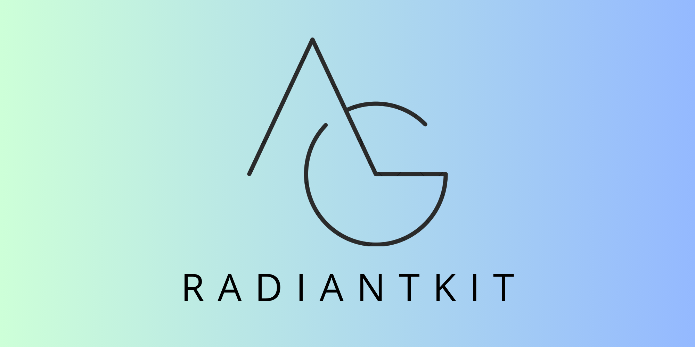

<h2 align="center">
    <b>Build Graphics Apps 10x Faster!</b>  
</h2>

<h3 align="center">
  <a href="https://www.radiantkit.xyz/">Website</a> &bull;
  <a href="https://demo.radiantkit.xyz/">Examples</a> &bull;
  <a href="http://docs.radiantkit.xyz/">Docs</a> &bull;
  <a href="https://join.slack.com/t/radiantkit/shared_invite/zt-25isowtr6-jg3wHcQjRuLxyeT_fELO9Q">Community</a>
</h3>

# RadiantKit

RadiantKit is an in-development framework to build graphics applications (like Figma, Canva, Miro, etc) that's free and open source. 

It introduces a node-component-system for efficient rendering, while ensuring complete extensibility. It can support both native and web (via WebAssembly) platforms.

## Basic Example

Install rust and follow these steps:
1. `cd examples/basic`
2. `cargo run`

## Egui Integration Example

Install rust and follow these steps:
1. `cd examples/egui`
2. `cargo run`

## Web Examples

Install yarn and follow these steps:
1. `cd examples/web`
2. `yarn install`
3. `yarn build:wasm`
4. `yarn start`

## Tauri

Follow steps for web till #3. Then, run `yarn tauri dev`.

## Contact
Send us an email at [hello@radiantkit.xyz](mailto:hello@radiantkit.xyz). You can also [join our slack](https://join.slack.com/t/radiantkit/shared_invite/zt-25isowtr6-jg3wHcQjRuLxyeT_fELO9Q) for quick help and support.
